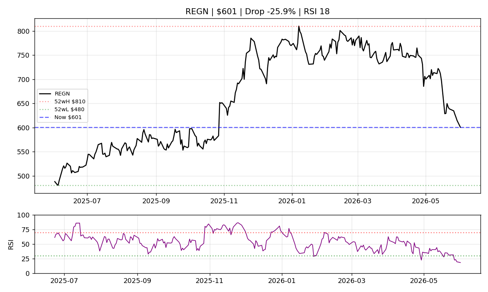
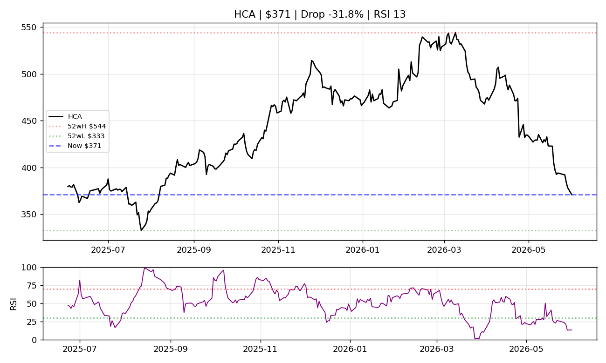
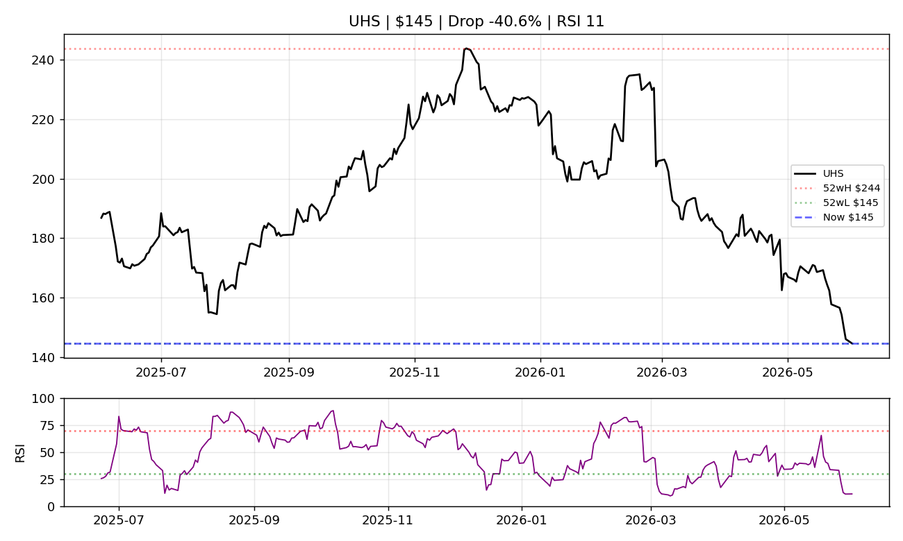
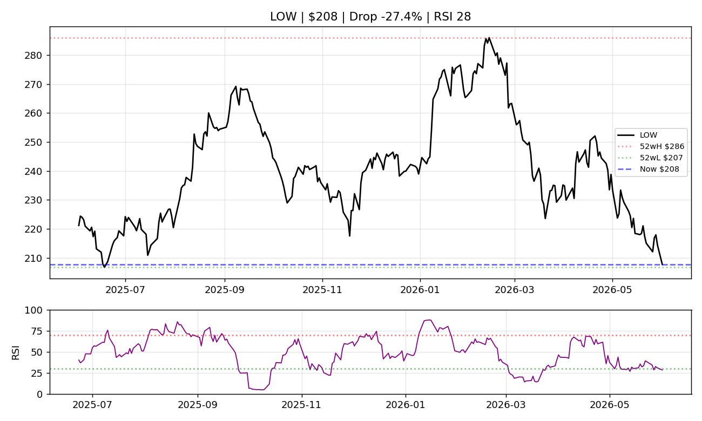
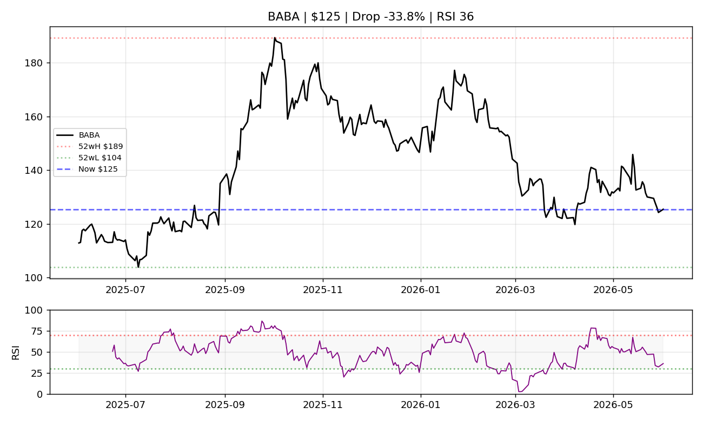

# Deep Value Screener — 2026-06-02

Scanned 129 stocks, found 26 candidates meeting criteria.
*Analysis generated at 12:10:34*

## 1. REGN — Regeneron Pharmaceuticals, Inc.  (Score: 12/15)

| Metric | Value |
|--------|-------|
| Price | $600.66 |
| Drop from 52w High | -25.9% |
| RSI(14) | 18.2 |
| PE | 14.7 |
| PB | 1.95 |
| Debt/Equity | 0% |
| Market Cap | $63.0B |
| Sector |  |

### Technical Analysis
- RSI is extremely oversold (<20). Historically this zone has seen strong bounces.
- Significant pullback of 26% from high. Worth watching.

### Fundamental Analysis
- PE ratio of 14.7 is reasonable.
- PB ratio of 1.95 suggests price is close to book value.
- Low debt/equity ratio of 0%. Financially conservative.

---

## 2. HCA — HCA Healthcare, Inc.  (Score: 12/15)

| Metric | Value |
|--------|-------|
| Price | $370.96 |
| Drop from 52w High | -31.8% |
| RSI(14) | 13.3 |
| PE | 12.8 |
| PB | -13.10 |
| Debt/Equity | 0% |
| Market Cap | $82.3B |
| Sector | Healthcare |

### Technical Analysis
- RSI is extremely oversold (<20). Historically this zone has seen strong bounces.
- Significant pullback of 32% from high. Worth watching.

### Fundamental Analysis
- PE ratio of 12.8 is reasonable.
- PB ratio of -13.10 suggests price is close to book value.
- Low debt/equity ratio of 0%. Financially conservative.

---

## 3. UHS — Universal Health Services, Inc.  (Score: 12/15)

| Metric | Value |
|--------|-------|
| Price | $144.69 |
| Drop from 52w High | -39.3% |
| RSI(14) | 11.2 |
| PE | 6.0 |
| PB | 1.17 |
| Debt/Equity | 0% |
| Market Cap | $8.8B |
| Sector |  |

### Technical Analysis
- RSI is extremely oversold (<20). Historically this zone has seen strong bounces.
- Price has dropped 39% from 52-week high. Deep value territory.

### Fundamental Analysis
- PE ratio of 6.0 is very low, suggesting potential undervaluation.
- PB ratio of 1.17 suggests price is close to book value.
- Low debt/equity ratio of 0%. Financially conservative.

---

## 4. LOW — Lowe's Companies, Inc.  (Score: 11/15)

| Metric | Value |
|--------|-------|
| Price | $207.70 |
| Drop from 52w High | -27.4% |
| RSI(14) | 28.4 |
| PE | 17.5 |
| PB | -12.57 |
| Debt/Equity | 0% |
| Market Cap | $116.5B |
| Sector |  |

### Technical Analysis
- RSI is oversold (<30). Watch for a reversal confirmation.
- Significant pullback of 27% from high. Worth watching.

### Fundamental Analysis
- PE ratio of 17.5 is reasonable.
- PB ratio of -12.57 suggests price is close to book value.
- Low debt/equity ratio of 0%. Financially conservative.

---

## 5. BABA — Alibaba Group Holding Limited  (Score: 11/15)

| Metric | Value |
|--------|-------|
| Price | $125.40 |
| Drop from 52w High | -29.2% |
| RSI(14) | 36.0 |
| PE | 19.3 |
| PB | 1.86 |
| Debt/Equity | 25% |
| Market Cap | $300.9B |
| Sector | Consumer Cyclical |

### Technical Analysis
- RSI is approaching oversold. Not quite there yet.
- Significant pullback of 29% from high. Worth watching.

### Fundamental Analysis
- PE ratio of 19.3 is reasonable.
- PB ratio of 1.86 suggests price is close to book value.
- Low debt/equity ratio of 25%. Financially conservative.

---

*Disclaimer: This is an automated screening report for educational purposes. Not investment advice.*